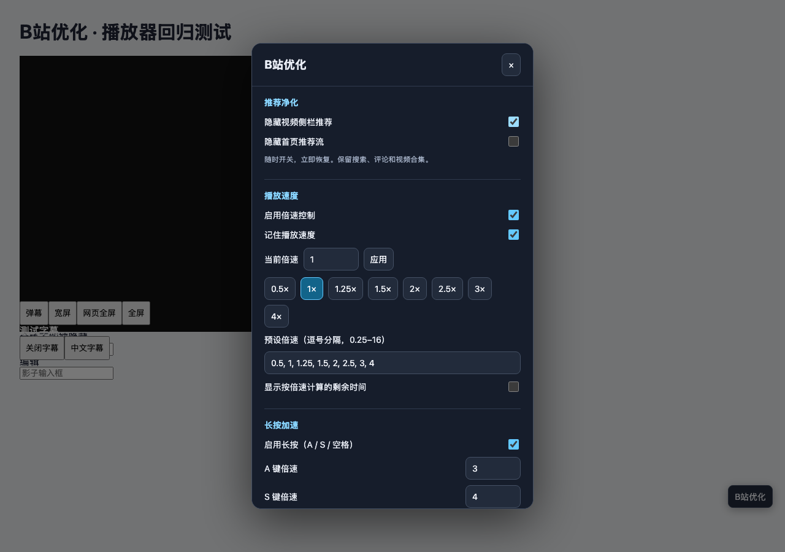

# B站优化 · Bilibili Tweaks

一个篡改猴脚本，集中管理 B 站的推荐净化、倍速、长按加速与播放器快捷键。纯 JavaScript，无运行时依赖，无统计上报。

**[点击安装](https://raw.githubusercontent.com/bigbitbox/bilibili-tweaks/main/bilibili-tweaks.user.js)** · [反馈问题](https://github.com/bigbitbox/bilibili-tweaks/issues)

安装后点击页面右下角 **B站优化**，或篡改猴菜单中的 **B站优化 · 设置**。所有开关立即生效并保存，不用改源码或刷新页面。



## 功能

| 功能 | 行为 |
| --- | --- |
| 视频侧栏推荐 | 默认隐藏，可即时恢复；保留评论、弹幕列表和视频合集 |
| 首页推荐流 | 独立开关，默认保留 |
| 播放速度 | 0.25–16×，自定义预设、排序去重、记忆速度 |
| 长按加速 | A 默认 3×、S 默认 4×；空格长按 350ms 固定 2×，短按播放/暂停 |
| 长按恢复 | 松键、切走窗口、页面隐藏、输入框获得焦点、播放器替换时恢复；多键按住时以最后一个为准 |
| 快捷键 | 弹幕、宽屏、网页全屏、全屏、字幕；面板内可修改字母键 |
| 剩余时间 | 根据当前倍速计算实际剩余观看时间 |
| 字幕 | 双击复制可用字幕；默认宽屏可单独启用 |

倍速控制、速度记忆、长按、数字键、播放器快捷键均可独立开关。关闭倍速控制后不再接管速度；已选择的播放速度保持不变。隐藏推荐只影响显示，不禁止 B 站加载数据，也不改变自动连播设置。

## 默认快捷键

| 按键 | 功能 |
| --- | --- |
| 长按 A / S | 临时 3× / 4×，可在面板修改 |
| 空格 | 短按播放/暂停，长按固定 2×，松手恢复原速 |
| → | 前进 5 秒，按住连续前进，不改变倍速 |
| B / H / 小键盘 * | 宽屏（B 可修改，H 为兼容别名） |
| F / G / 小键盘 − | 网页全屏 |
| ⌘F（Meta+F）/ 小键盘 9 | 真正全屏 |
| D / 小键盘 7 | 弹幕 |
| Z | 字幕 |
| 小键盘 5 | 播放 / 暂停 |
| 小键盘 + | 循环预设倍速 |
| Ctrl + ↑ / ↓ | 上一档 / 下一档倍速 |
| 主键盘上方 1 / 2 / 3 / 4 | 直接设置并记忆 1× / 1.3× / 1.5× / 2× |
| F2 | 显示 / 隐藏剩余时间 |

输入框、可编辑评论、Shadow DOM 输入框、输入法组合输入以及设置面板中不会触发播放器快捷键。只接管已配置的全屏 Cmd 组合键（默认 ⌘F），其余 Cmd、Alt、Shift 组合键交给浏览器。原站的其他键照常使用。

## 安装与迁移

1. 安装 [Tampermonkey](https://www.tampermonkey.net/)。Chromium 系浏览器需在扩展详情开启 **允许运行用户脚本 / Allow User Scripts**。
2. 点击上方安装链接，确认脚本名称为 **B站优化 · Bilibili Tweaks**，完成安装后刷新 B 站页面。
3. 停用此前的四个重叠脚本：长按倍速、Hide Bilibili Recommendations、一键弹幕/宽屏快捷键、高级倍速。
4. 如果还使用 **h5player / 音视频增强脚本**，在它的设置中对 B 站禁用，避免两套速度锁定和快捷键同时生效。其他网站仍可继续使用 h5player。

新脚本使用独立的篡改猴存储，不读取、覆盖旧脚本的设置。可保留旧脚本作为回退，重新启用前先停用本脚本。

更新由篡改猴根据 `@updateURL` 检查版本，再从 `@downloadURL` 下载；无需构建或外部 CDN。维护者发版时同步提升 `.user.js` 与 `.meta.js` 的版本。

## 适配范围与边界

- 匹配 `https://www.bilibili.com/*`，不进入第三方站点、直播站或 iframe。
- 以桌面新版 `bpx-player` 为主要适配对象；包含旧版播放器控件及 `bwp-video` 的兼容路径。
- 视频、列表、番剧、课堂和活动页面使用同一播放器发现逻辑；真实测试覆盖范围见 [测试记录](docs/testing.md)，并非每种页面都已实站验证。
- 高倍速最终取决于浏览器和解码器。16× 是输入上限，不保证所有视频能流畅播放或保留音频。
- 仅操作页面现有能力，不解锁会员、付费内容、清晰度或登录限制。字幕不可用时会给出提示。
- B 站 DOM 升级可能需要更新选择器。没有加载出视频时设置面板仍可使用。
- 设置在打开页面时读取；其他已打开标签页刷新后读取新配置。

## 开发

运行时就是根目录的 `bilibili-tweaks.user.js`，不需要打包。

```sh
npm ci
npx playwright install chromium
npm run check
npm test
# 可选：联网访问真实 B 站首页及公开视频
npm run test:live
```

`BROWSER_PROXY` 可为实站测试指定现有 HTTP 代理，`VIDEO_URL` 可指定公开视频链接。测试只使用干净浏览器，无需复制用户登录信息。

回归测试通过真实 Chromium 验证 DOM、键盘、存储和播放器生命周期；测试页面及 GM 替身不等于篡改猴端到端测试，两者在测试记录中分别列出。

## 功能来源

本仓库从统一设置与事件生命周期出发重新实现，未打包原脚本或其依赖。功能参考：

- [bilibili 哔哩哔哩长按倍速](https://greasyfork.org/scripts/444636)，0.8，作者 rytter。
- [BiliBili 一键开关弹幕 / 宽屏 / 全屏 / 速度快捷键](https://greasyfork.org/scripts/382135)，0.5，作者 R君；保留个人配置中的 B 宽屏键。
- [BiliBili 高级倍速功能](https://greasyfork.org/scripts/479080)，1.9，作者 TheBszk。
- 用户原有本地 Hide Bilibili Recommendations 0.1，仅在 load 时隐藏 `.rec-list` 和 `.next-play`。

原脚本版权及许可归各自作者；本仓库新实现以 [MIT](LICENSE) 发布。

BewlyCat 兼容：脚本在 window 捕获阶段处理快捷键，B 切换原生宽屏，不显示 BewlyCat 的视频标题；网页全屏下仍支持空格和 A/S 长按。升级后请刷新已有视频页。
